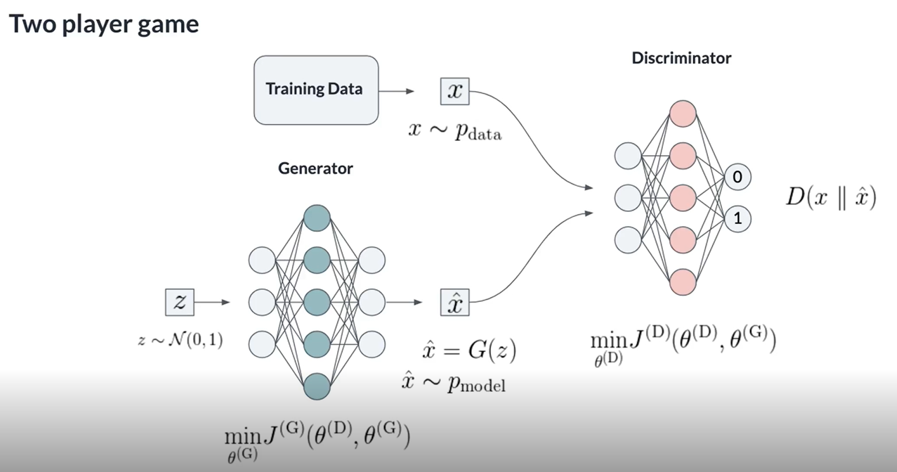

# Generative Adversarial Networks

https://github.com/DJRumble/neural_networks/tree/master/GAN_tutorial

Discriminative - probability of the target given the observation (conditional probability of Y given X, e.g. logistic observtion)

Generative - joint probability distribution of X and Y. Can describe how likely a specific exampel is. Has strenths in:
* Powerful way of learning distributions
* Incorporated in reinforcement learning
* Multimodal outputs
* Semi-supervised learning
E.g. maximum likelyhood estimatation - Naive Bayes Classification 

## The GAN Framework 

1. Simplistic generator network with inputs sampled from a normal distribution and outputs some fake gaussian noise data
2. The actual training data
3. Label real and fake data 1/0
4. feed into a 'discriminator' which has to try to classify the real data

### Generator
'''
class Generator(tf.keras.Model):
 
    def __init__(self, n_inp, n_noise, n_hid=128):
        super().__init__()
        init = tf.keras.initializers.GlorotUniform
        self.input_layer = Dense(units=n_noise, kernel_initializer=init)
        self.hid_1 = Dense(units=n_hid, activation="tanh", kernel_initializer=init)
        self.output_layer = Dense(units=n_inp, activation="tanh", kernel_initializer=init)
 
    def call(self, inputs):
        x = self.input_layer(inputs)
        x = self.hid_1(x)
        return self.output_layer(x)
'''

### Discriminator
'''
class Discriminator(tf.keras.Model):
 
    def __init__(self, n_inp, n_hid=128):
        super().__init__()
        init = tf.keras.initializers.GlorotUniform
        self.input_layer = Dense(units=n_inp, kernel_initializer=init)
        self.hid_1 = Dense(units=n_hid, activation="tanh", kernel_initializer=init)
        self.logits = Dense(units=1, activation="sigmoid", kernel_initializer=init)
 
    def call(self, inputs):
        x = self.input_layer(inputs)
        x = self.hid_1(x)
        return self.logits(x)
'''

#### Loss functions

* generator - Trying to replicate the real data
* discriminator - cross entropy loss

'''
cross_entropy = tf.keras.losses.BinaryCrossentropy(from_logits=True)

gen_loss = cross_entropy(tf.ones_like(fake_output), fake_output)
disc_loss = cross_entropy(tf.ones_like(real_output), real_output) + cross_entropy(tf.zeros_like(fake_output), fake_output)
'''

DominoDataLab free trial - https://try.dominodatalab.com/u/damianjackrumble/djr_GAN/browse?

#### Mode collapse

When the generator successfully identifies one class.... and then only predicts that at the expense of the others. Can be imporved by using a WGAN - an optimisation based on the Wasserstein distance. Here the discriminator is called the critic as is not constrained to an output of 0 or 1.  

'''
class Critic(tf.keras.Model):
 
    def __init__(self, n_inp, n_hid=128):
        super().__init__()
        init = tf.keras.initializers.GlorotUniform
        self.input_layer = Dense(units=n_inp, kernel_initializer=init)
        self.hid_1 = Dense(units=n_hid, activation="tanh", kernel_initializer=init)
        self.logits = Dense(units=1, activation=None, kernel_initializer=init)
 
    def call(self, inputs):
        x = self.input_layer(inputs)
        x = self.hid_1(x)
        return self.logits(x)

wasserstein = tf.reduce_mean(real_output) - tf.reduce_mean(fake_output)
'''